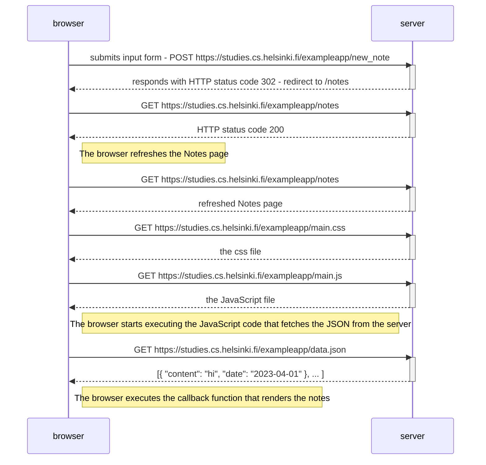

# web-crash-course

```mermaid
  sequenceDiagram
    participant browser
    participant server

    browser->>server: submits input form - POST https://studies.cs.helsinki.fi/exampleapp/new_note
    activate server
    server-->>browser: responds with HTTP status code 302 - redirect to /notes
    deactivate server

    browser->>server: GET https://studies.cs.helsinki.fi/exampleapp/notes
    activate server
    server-->>browser: HTTP status code 200
    deactivate server

    Note right of browser: The browser refreshes the Notes page

    browser->>server: GET https://studies.cs.helsinki.fi/exampleapp/notes
    activate server
    server-->>browser: refreshed Notes page
    deactivate server

    browser->>server: GET https://studies.cs.helsinki.fi/exampleapp/main.css
    activate server
    server-->>browser: the css file
    deactivate server

    browser->>server: GET https://studies.cs.helsinki.fi/exampleapp/main.js
    activate server
    server-->>browser: the JavaScript file
    deactivate server

    Note right of browser: The browser starts executing the JavaScript code that fetches the JSON from the server

    browser->>server: GET https://studies.cs.helsinki.fi/exampleapp/data.json
    activate server
    server-->>browser: [{ "content": "hi", "date": "2023-04-01" }, ... ]
    deactivate server

    Note right of browser: The browser executes the callback function that renders the notes
    
```
